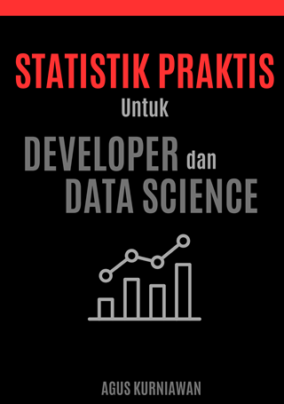

# Statistik Praktis untuk Developer dan Data Science

Dalam era digital yang penuh dengan data, kemampuan untuk memahami dan menerapkan prinsip statistik telah menjadi kebutuhan esensial bagi developer dan praktisi data science. "Statistik Praktis untuk Developer dan Data Science" menawarkan panduan komprehensif yang menggabungkan teori dan praktik, dirancang khusus untuk mereka yang bekerja di ranah teknologi. Mulai dari konsep dasar statistik, eksplorasi data, hingga penerapan statistik dalam machine learning dan pengembangan software, buku ini menyediakan alat dan teknik yang diperlukan untuk mengambil keputusan berdasarkan data. Dilengkapi dengan contoh kode dalam Python, latihan, dan studi kasus, buku ini menjadi sumber daya yang tak ternilai bagi siapa saja yang ingin mendalami peran statistik di dunia teknologi modern.

## Publikasi

* Google Play Books: https://play.google.com/store/books/details?id=RRvcEAAAQBAJ 
* Lulu: https://www.lulu.com/shop/agus-kurniawan/statistik-praktis-untuk-developer-dan-data-science/ebook/product-kvnjg77.html  

Untuk pengguna iOS, silakan gunakan Google Play Books. Kemudian dapat membeli buku ini melalui Google Play Books. Alternatif lain, pembelian buku dapat dilakukan melalui website Google Play Books.